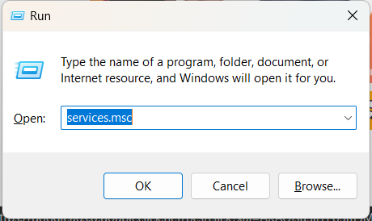
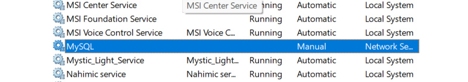

<div align=center>

# MySQL Installation Guide

[Installation Status](#1-check-the-installation-status)</br>

</div>

## 1. Check the Installation Status

### 1.1 Ubuntu (Linux)
1. Open a terminal by pressing `Ctrl + Alt + T`.

2. To check if MySQL is installed, type the following command:
```bash
mysql --version
```

- If **MySQL** is installed, you should see output similar to:
```bash
mysql  Ver 8.0.26 for Linux on x86_64 (MySQL Community Server - GPL)
```

- If **MySQL** is not installed, you will see an error message like:
```bash
Command 'mysql' not found, but can be installed with:
sudo apt install mysql-client
```

### 1.2 Windows
1. Press the `Win + R` keys to open the **Run** dialog box, then type `service.msc` and press Enter to open the **Services** window.


2. In the list of services, search for **MySQL**. If it appears, MySQL is already installed on your system. If it’s not listed, MySQL has not been installed.



## 2. Install MySQL (If Not Installed)
### 2.1 Ubuntu (Linux)
#### 2.1.1 Update Package Information
Before installing MySQL, it’s a good idea to update the package repository to ensure you're installing the latest versions:
```bash
sudo apt update
```

#### 2.1.2 Install MySQL Server
1. Install **MySQL** with the following command:
```bash
sudo apt install mysql-server
```

2. During the installation, Ubuntu will automatically set up MySQL and start the MySQL service.

#### 2.1.3 Secure MySQL Installation
Once **MySQL** is installed, run the `mysql_secure_installation` command to secure your installation. This will help you set a root password, remove insecure defaults, and configure **MySQL** for better security.

Run the command:
```bash
sudo mysql_secure_installation
```

Follow the prompts to:
- Set a root password (if not already set).
- Remove insecure default settings, such as test databases and remote root login.

#### 2.1.4 Check MySQL Service Status
To verify if MySQL is running, check the service status:
```bash
sudo systemctl status mysql
```

- If MySQL is running, you should see output like:
```yaml
● mysql.service - MySQL Community Server
   Loaded: loaded (/lib/systemd/system/mysql.service; enabled; vendor preset: enabled)
   Active: active (running) since Thu yyyy-nn-dd HH:MM:SS UTC; 1h 59min ago
   ...
```

- If MySQL is not running, you can start it with:
```bash
sudo systemctl start mysql
```

### 2.2 Windows
#### 2.2.1 Download MySQL Installer
1. Visit the official [MySQL website](https://dev.mysql.com/downloads/mysql/) to download the MySQL Installer. Choose the appropriate version based on your system (Windows 32-bit or 64-bit).

2. Click on the Download button and choose the "Windows (x86, 32-bit), MySQL Installer" option.

#### 2.2.2 Install MySQL Using the Installer
1. Once the installer is downloaded, double-click the installer file to start the MySQL installation process.

2. Choose the **Setup Type**: For beginners, it's recommended to select **Developer Default** as it installs all the necessary components, including MySQL Server, MySQL Workbench, and other development tools.

3. Follow the on-screen instructions:
- **MySQL Server Configuration**
    > Choose the configuration settings. You can select Development Machine for a basic installation.
- **Root Password**
    >  Set the root password for MySQL. Keep this password secure, as you'll need it to access your MySQL instance.

4. Once the installation completes, the installer will prompt you to **Start MySQL**. Confirm the service is running by checking the **Services** window (as shown in Step 1).

## 3. Verify MySQL Installation
### 3.1 Ubuntu (Linux)
1. Open a terminal and log into MySQL as the root user by typing:
```bash
sudo mysql -u root -p
```

2. When prompted, enter the root password you set during installation.

3. If you successfully log in, you should see the MySQL prompt:
```bash
mysql>
```

If MySQL is properly installed, you can now run SQL queries and manage databases from here.


### 3.2 Windows
1. Open the **Command Prompt** or **PowerShell** by pressing `Win + R`, typing `cmd` or `powershell`, and hitting Enter.

2. Type `mysql -u root -p` and press Enter. When prompted, enter the root password you set during installation.

If MySQL is installed and the root password is correct, you should see the MySQL command-line interface.

## 4. Troubleshooting
### 4.1 Ubuntu (Linux)
#### 4.1.1 MySQL Service Not Starting
If the MySQL service is not starting, you can check the logs to see what's causing the issue:

```bash
sudo journalctl -xe
```

This will show detailed logs to help identify why MySQL isn't starting. Common causes include missing dependencies or misconfigurations.

You can also try restarting the service:

```bash
sudo systemctl restart mysql
```

#### 4.1.2 Reinstalling MySQL
If you encounter issues with MySQL, you may need to reinstall it. Follow these steps to completely remove MySQL and reinstall:

1. Remove MySQL completely:
```bash
sudo apt remove --purge mysql-server mysql-client mysql-common mysql-server-core-* mysql-client-core-*
sudo apt autoremove
sudo apt autoclean
```

2. After removing MySQL, you can reinstall it by following the steps in Section 2.

### 4.2 Windows
#### 4.2.1 MySQL Service Not Starting
If the MySQL service doesn't start or is listed as "stopped" in the Services window, try restarting your computer. If that doesn’t work, you can:

1. Open the Services window (`Win + R`, then type `service.msc`).
2. Locate `MySQL` in the list.
3. ***Right-click*** and select **Start** or **Restart**.

#### 4.2.2 Reinstalling MySQL
If you're unable to start MySQL or encounter other issues, you may need to reinstall MySQL:

1. Uninstall MySQL via `Control Panel` > `Programs and Features`.
2. Follow the steps in Section 2 to download and install MySQL again.

## 5. Next Steps
### 5.1 Ubuntu (Linux)
After successfully installing and running MySQL, you can use tools like MySQL Workbench or phpMyAdmin to manage your databases. You can also continue to work with MySQL via the command line for tasks such as creating databases and managing users.

### 5.2 Windows
Once MySQL is installed and running, you can use MySQL Workbench to interact with your databases or connect to MySQL from the command line using the MySQL client.

---
<div align="right">

###### *Last Modified by [SeeChen](https://github.com/SeeChen/) @ 11-NOV-2024 00:54 UTC +08:00*
</div>